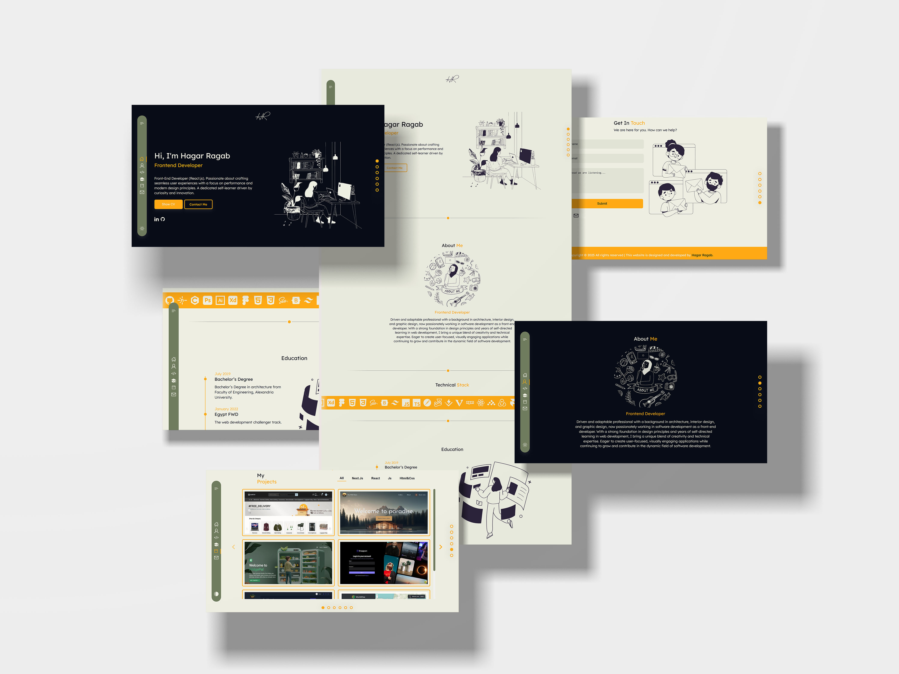

### **Personal Website Overview**

This **Personal Website** is a **single-page application (SPA)** built with **React.js**, featuring a modern and interactive design. It includes multiple sections that highlight personal details, skills, and projects while offering a seamless user experience with smooth animations and efficient form handling.

---

### **Live Demo**

[click here](https://hagar-ragab.netlify.app/)

### **Features & Sections**

1. **Personal Introduction:**

    - A brief bio introducing the individual, their expertise, and career aspirations.
    - Smooth entrance animations using **Framer Motion**.

2. **Education:**

    - A section showcasing academic background and relevant certifications.
    - Styled with engaging visual elements for a polished presentation.

3. **Tech Stack:**

    - Displays a list of technologies and tools used, visually represented with icons and animations.

4. **Projects:**

    - A showcase of completed and ongoing projects with **Blurhash** used for image placeholders to enhance loading performance.
    - Each project card includes descriptions, technologies used, and links.

5. **Contact Section:**

    - A form for visitors to send messages directly via **EmailJS**.
    - Integrated with **React Hook Form** for validation and **Hot Toast** for user feedback.
    - A **bad-words filter** ensures appropriate messages.

6. **Smooth Navigation:**
    - Implemented with **React Scroll** for seamless scrolling between sections.

---

### **Technologies & Libraries Used**

-   **React.js** – Core framework for building the SPA.
-   **Framer Motion** – Adds smooth animations and transitions.
-   **EmailJS** – Handles email submissions without requiring a backend.
-   **Bad-Words** – Filters inappropriate language in contact messages.
-   **Blurhash** – Enhances image loading performance.
-   **React Hook Form** – Provides efficient form validation.
-   **Hot Toast** – Displays real-time user notifications.
-   **React Scroll** – Enables smooth scrolling between sections.

---

### **Conclusion**

This **personal website** serves as a professional and interactive portfolio, effectively showcasing skills, projects, and experience. It combines modern technologies and UI/UX enhancements to provide visitors with a smooth and engaging experience.
